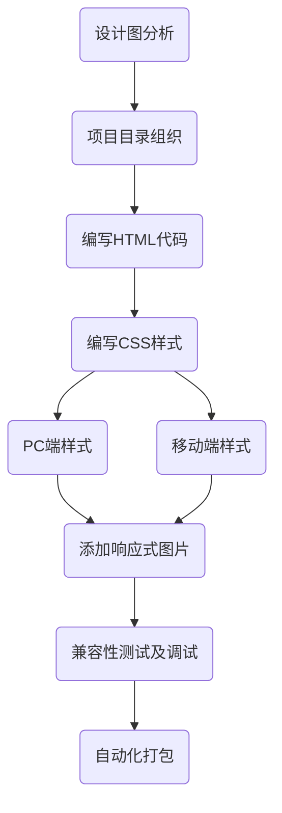

# 前端练习小项目

> Nothing is all

## Introduction

---

​       这段时间看了HTML5 / CSS3 / JavaScript 等编程语言，并练习了两个小项目，以加深对它们的理解。

## Project-1 响应式网页

---

​       以互联网金融产品为背景，通过响应式开发，实现了可以在不同屏幕尺寸下正常展示的页面。

### 涉及编程语言

| 编程语言         | 占比   |
| ---------------- | ------ |
| HTML5 / CSS3     | 98.33% |
| jQuery / Node.js | 1.67%  |

### 涉及工具

- OwlCarousel2 
- Modernizr
- picturefill 
- Sass 
- PostCSS 
- Gulp
-  . . .

### 编程流程

### 项目快照

## Project-2 网页游戏

---

​		以“别踩白块”为游戏原型

### 设计编程语言

---

| 编程语言     | 占比   |
| ------------ | ------ |
| HTML5 / CSS3 | 31.27% |
| JavaScript   | 68.73% |

### 项目快照

---

### 游戏逻辑

---

